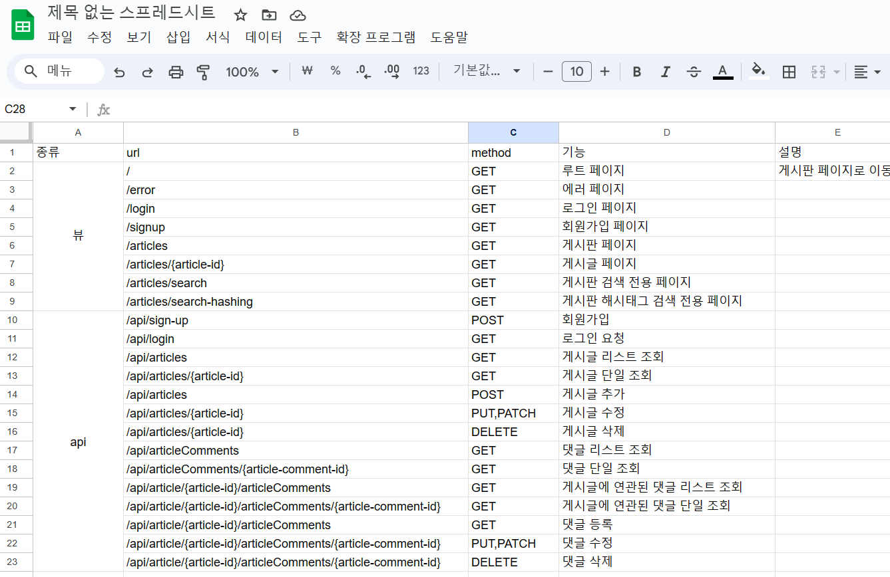
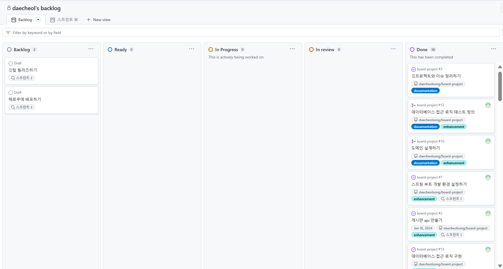
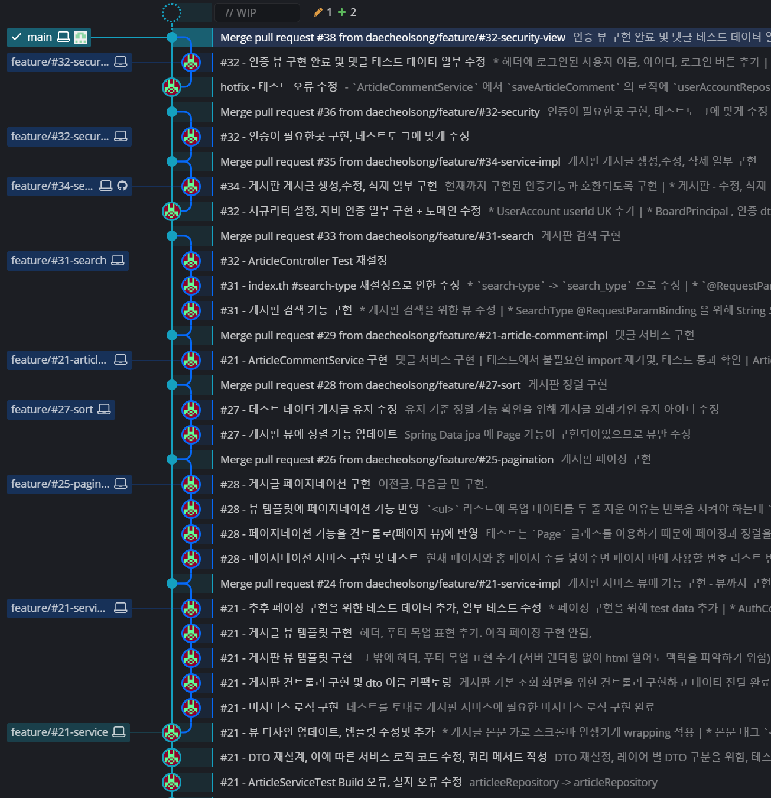

# 게시판 만들기

## 소개

간단한 게시판 서비스

## 프로젝트 관리

### API SPEC 설계

- Goolgle 스프레드 시트를 통해 API Spec 정의

### BackLog

- 프로젝트 동한 할일을 GitHub Project 를 통해서 관리

### ERD, Use Case

- draw.io 를 통하여 ERD, Use Case 관리

<table>
    <tr>
        <td>
            
        </td>
        <td>
            
        </td>
    </tr>
</table>

### 형상 관리
- GitKraken GUI 를 이용하여 형상 관리

## 기능

### 회원

- 로그인

### 게시글

- 게시글 생성, 수정, 삭제
- 태그별 게시글 조회
- 게시글 제목, 작성자, 태그, 작성일 기준으로 정렬

### 댓글

- 댓글 생성, 삭제

## 기술

- Framework : Spring, Spring Boot
- 빌드 및 의존성 관리 : Gradle
- DB, DB 엑세스, 쿼리 : Mysql, H2 (Test), Spring Data JPA, QueryDSL
- RESTful API  : Spring Data Rest Repositories, Repositories HAL Explorer

- 웹 : Spring Web
- 디자인 : Bootstrap 5.2
- 인증 : Spring Security
- 생산성 : Lombok, Spring devtools, Spring boot Actuator
- 프로젝트, 형상관리 : github, gitKraken
